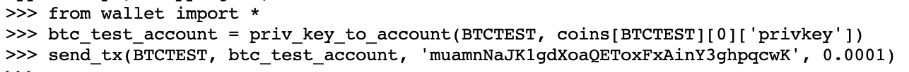
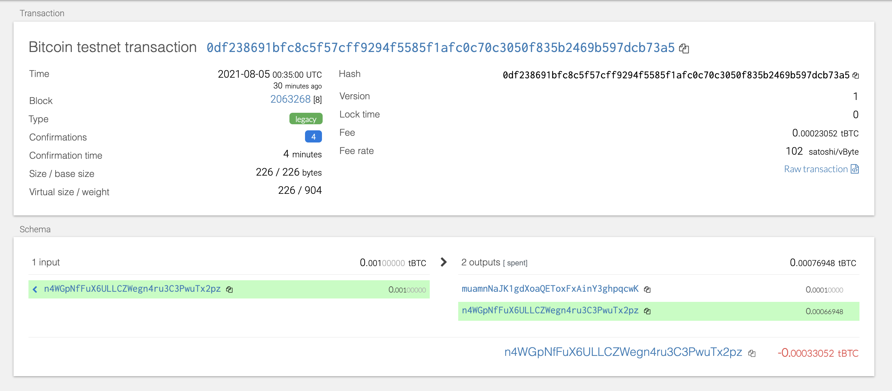
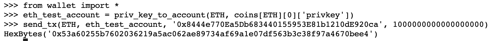
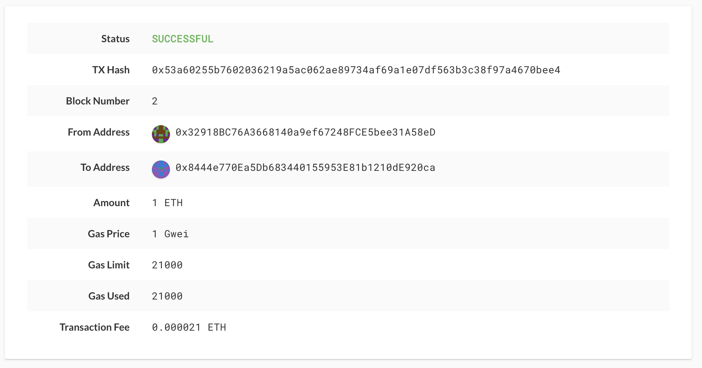

# 19-Blockchain-Python

### BTCTEST
1. To send a transaction using the BTC test net, first load the 12 word mnemonic in the environment variable in order to fetch the derived addresses
2. using the private key from the derived address to get the btc test net account by using the priv_key_to_account function
3. send desired transaction using the send_tx function
4. verify that your transaction is confirmed on block explorer https://tbtc.bitaps.com/

### ETH
1. To send a transaction using the ETH test net, first load the 12 word mnemonic in the environment variable in order to fetch the derived addresses
2. Have your local network running (see homework 18), using ./geth --datadir node1 --unlock "56a9cF62e47E9dA59EBc77d682c330Ec52F89753" --mine --miner.threads 1 --rpc --allow-insecure-unlock and ./geth --datadir node2 --unlock "7Bc565bE5bcfDB45b8525E424778E9AD5B09C64C" --port 30304 --bootnodes "enode://e07becec1bbd1ef2e24dc269b8b02b7119a759de0c033382829718c3fbaadfd6bce014c9668f239771c0b7ce77c1ddd8e30c8a5cfe3ec46f368f311f73c10ee2@127.0.0.1:30303" --allow-insecure-unlock --mine --miner.threads 1 to start the two nodes
3. using the private key from the derived address to get the btc test net account by using the priv_key_to_account function
4. send desired transaction using the send_tx function
5. Use MyCrypto, navigate to TX Status and enter the transaction hash to check the status of the transaction.

